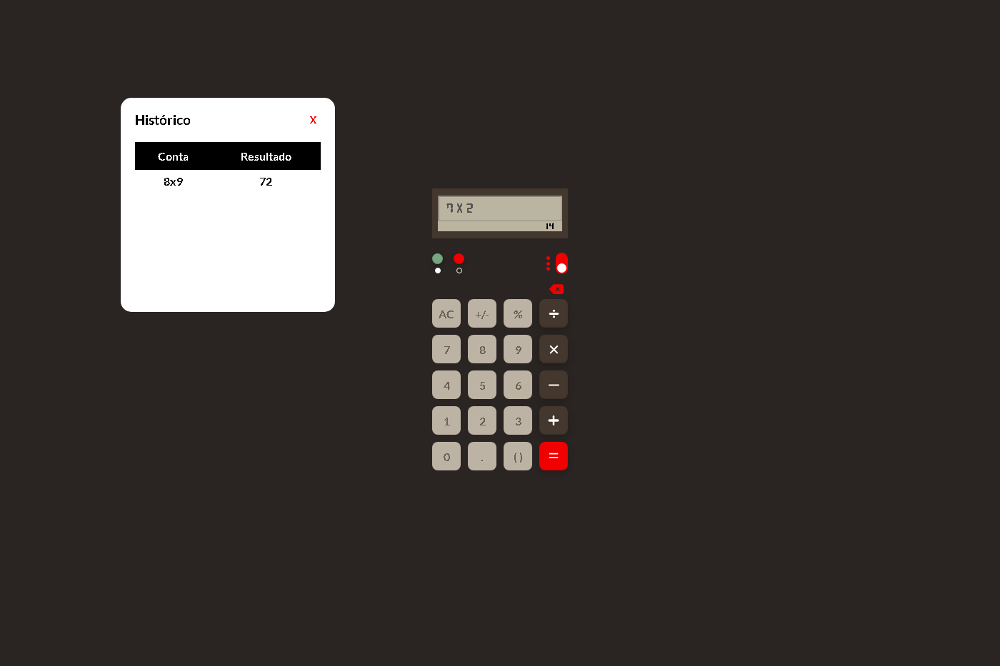
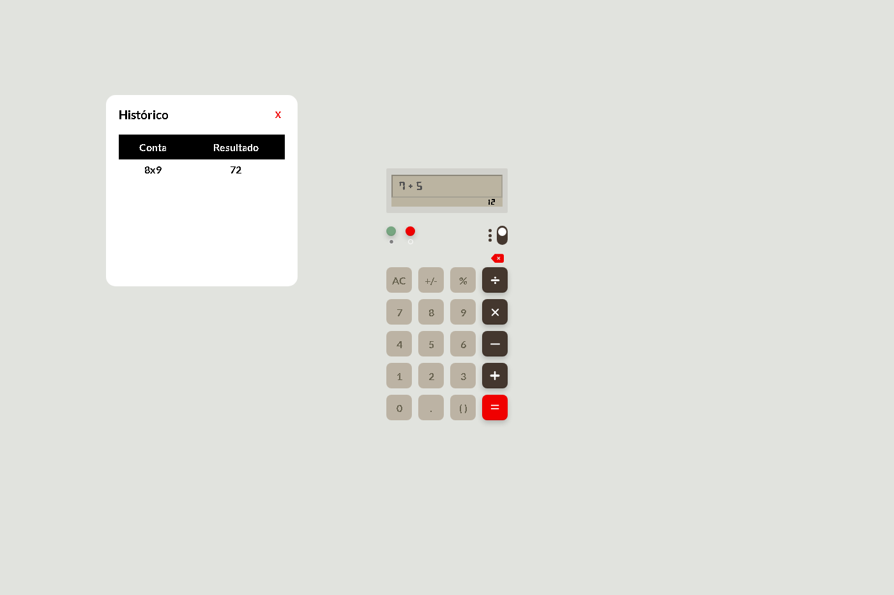

# Calculator Project

## Overview

This project is a JavaScript-based calculator that includes basic arithmetic operations, percentage calculations, and supports history tracking. It also features a dark mode toggle and an interactive history display.




## Features

-   Basic arithmetic operations: addition, subtraction, multiplication, and division.
-   Percentage calculations.
-   History tracking with a draggable history window.
-   Dark mode toggle.
-   Input validation and error handling.

## Installation

To set up this project locally, follow these steps:

1. **Clone the repository:**

    ```bash
    git clone https://github.com/Macedo890/Calc.git
    ```

2. **Navigate into the project directory:**

    ```bash
    cd Calc
    ```

3. **Open the `index.html` file in your preferred web browser:**

    ```bash
    open index.html
    ```

## Usage

-   **Basic Operations:** Click on the buttons to perform basic arithmetic operations.
-   **Percentage Calculation:** Use the `%` button to calculate percentages.
-   **Toggle Dark Mode:** Click the dark mode switch to toggle between light and dark themes.
-   **View History:** Click the history button to view and interact with the calculation history. The history panel can be dragged around the screen.
-   **Clear History:** Use the clear history button to remove all entries from the history.

## Functionality

### `evaluateExpression(expression)`

Evaluates a mathematical expression string, handling common operations and percentages. Includes functionality to handle missing operators before parentheses.

### `saveMemoryToSessionStorage()`

Saves the calculation history (`countMemory` and `resultMemory`) to session storage.

### `showHistory()`

Displays the calculation history in a draggable table format.

### `cleaningParentheses()`

Resets the parentheses button text to `()`.

### `toggleSign()`

Toggles the sign of the last number in the input field.

### `countmemoryPush(expression)`

Pushes the current expression into the calculation history with `*` replaced by `x`.

## Contributing

Contributions are welcome! Please follow these steps:

1. **Fork the repository.**
2. **Create a new branch for your changes.**
3. **Make your changes and test them.**
4. **Submit a pull request with a description of your changes.**

## License

This project is licensed under the MIT License. See the [LICENSE](LICENSE) file for details.

## Acknowledgements

-   The project utilizes standard HTML, CSS, and JavaScript.
-   Special thanks to contributors and the open-source community for inspiration and tools.
